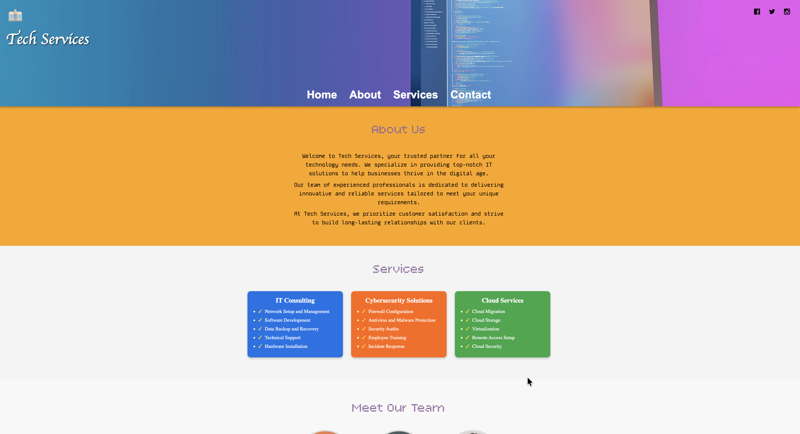

# Tech_Services_Home_Page

A responsive landing page for a Tech Services company showcasing About, Services, and Team sections with modern UI and smooth scrolling navigation.

---

## Table of Contents

- [Demo](#demo)  
- [Features](#features)  
- [Technologies Used](#technologies-used)  
- [Installation](#installation)  
- [Project Structure](#project-structure)  
- [License](#license)  

---

## Demo

  


---

## Features

- **Responsive design** for desktop, tablet, and mobile devices.  
- **Hero header** with logo, social media icons, and navigation menu.  
- **About section** detailing the company profile.  
- **Services section** with 3 colored cards, each listing key offerings.  
- **Team section** with circular profile images, names, and positions.  
- Smooth hover effects for buttons, icons, and cards.  
- Google Fonts integration for modern typography.  
- Scroll-to-section navigation using anchor links.

---

## Technologies Used

- HTML5  
- CSS3  
- Google Fonts  

Optional: You can integrate JavaScript in the future for animations or additional interactivity.

---

## Installation

1. Clone the repository:

```bash
git clone https://github.com/codesavinash/Tech_Services_Home_Page.git
